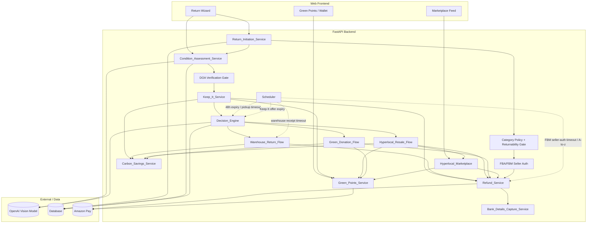
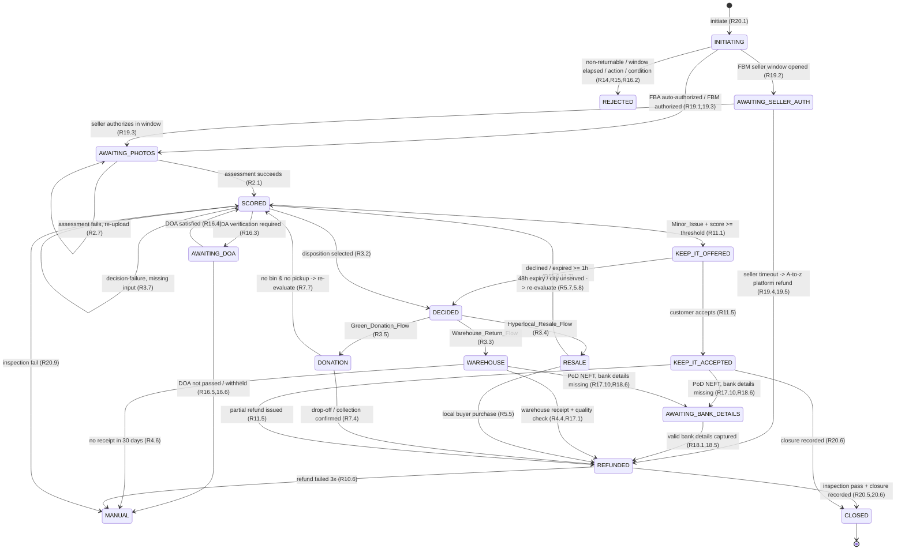
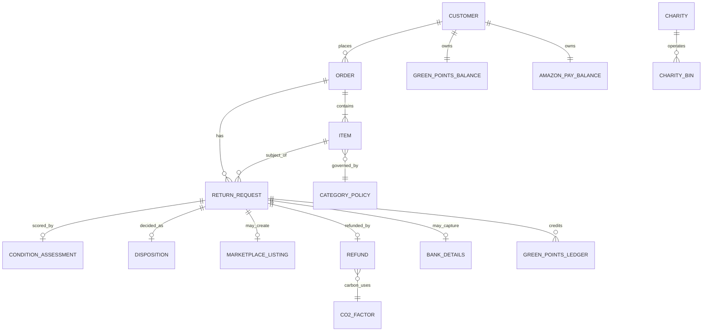

# Design Document: Amazon SecondLife AI

## Overview

Amazon SecondLife AI intercepts an e-commerce return at the moment of initiation and decides, before any shipping label exists, whether the item should travel back to a warehouse, be resold to a local buyer, or be donated to a nearby charity. The decision is driven by two signals: an AI-derived `SecondLife_Score` (0-100) describing the item's physical condition, and a unit-economics comparison between the `Reverse_Logistics_Cost` and the `Depreciated_Item_Value`.

The `Decision_Engine` uses a **hybrid LLM-primary design**: an OpenAI model is the primary decider, producing the `SecondLife_Score`, the selected disposition, and a natural-language reasoning string in a single structured-JSON reasoning step, given the photos (or condition context), item context, and computed economics. A **deterministic rule-based engine** (the original score/weight/cost-vs-value thresholds) is retained as (a) a fallback when the LLM call fails, times out, or returns an invalid disposition, (b) a shadow decision computed and logged alongside every LLM decision for auditability, and (c) a configurable safety guardrail that can override an LLM disposition violating a hard economic constraint. Regardless of which path is taken, the system always records **exactly one final disposition** with a `decisionSource` flag, preserving the Requirement 3 guarantees.

This document describes a reference implementation built on a **FastAPI (Python)** backend, an **OpenAI vision model** for photo-based condition assessment, and a **clean web frontend** that demonstrates three end-to-end scenarios:

| Scenario | Category | Condition | Economics | Disposition |
|----------|----------|-----------|-----------|-------------|
| 1 | Electronics | Pristine (score ≥ 80) | High value, value > logistics cost | Return to Warehouse |
| 2 | Home Appliances | Like-new (score ≥ 80) | Bulky (≥ 10 kg), logistics cost > value | Hyperlocal Resale |
| 3 | Footwear | Worn (score 0-79) | Low value, logistics cost ≥ 50% of value | Green Donation |

The design maps each named requirement component to a concrete FastAPI service module, defines the REST API surface, specifies the data schema, formalizes the `Decision_Engine` algorithm, details the OpenAI scoring methodology, enumerates the seed datasets required to build and demo the system, and derives correctness properties from the acceptance criteria for property-based testing.

### Design Goals

- **Deterministic decisioning (fallback/guardrail layer)**: The LLM is the primary decider and is non-deterministic by nature; the retained rule-based engine is a pure function that, given complete inputs, selects exactly one disposition reproducibly. The system always records exactly one final disposition with a valid `decisionSource`, and when `decisionSource = RULE_FALLBACK` the final disposition equals the rule engine's output (Requirement 3).
- **Comparable scoring**: Scores produced by the vision model are stable and comparable across items and categories (Requirement 2.2).
- **Financial safety**: At most one refund per return request, refunds in order currency, idempotent and retried (Requirement 10).
- **Reward integrity**: Green Points credited at most once per return request, balances never negative, redemption atomic (Requirements 8, 9).
- **Concurrency safety**: A marketplace listing is sold to at most one buyer (Requirement 6.5).
- **Keep It net-profit safety**: When a minor-issue return qualifies, the `Partial_Refund_Amount` is bounded so the company stays in net profit (amount > 0, amount < price, amount < reverse-logistics cost, and amount + retained value ≤ reverse-logistics cost) and accepting it skips all return logistics (Requirement 11).
- **Sustainability transparency**: Every non-warehouse resolution reports the CO2 avoided alongside money saved; warehouse resolutions report 0 kg (Requirement 12).
- **Amazon.in policy alignment**: Returnability is checked before the category window; category-specific windows, allowable actions, DOA verification, payment-method refund timelines, secure Pay-on-Delivery bank capture, and FBA/FBM with A-to-z protection are enforced through an ordered standard return flow (Requirements 13-20).

## Architecture

### Component Map

Each requirement-defined component maps to a FastAPI router/service module backed by a shared persistence and domain layer.

| Requirement Component | FastAPI Module | Responsibility |
|-----------------------|----------------|----------------|
| Return_Initiation_Service | `services/return_initiation.py` | Validate eligibility, create return requests, capture reason and item snapshot, block label until disposition exists |
| Condition_Assessment_Service | `services/condition_assessment.py` | Validate photos, call OpenAI vision model, produce `SecondLife_Score` + summary |
| Decision_Engine | `services/decision_engine.py` | Compute economics, call the LLM for the primary score+disposition+reasoning, compute the rule-based shadow/fallback decision, apply safety guardrails, select exactly one final disposition, write audit record |
| Warehouse_Return_Flow | `services/warehouse_flow.py` | Show message, generate label, route to Refurbished, trigger refund on receipt |
| Hyperlocal_Resale_Flow | `services/resale_flow.py` | Create listing, manage 48h window, arrange pickup, trigger refund + points on sale |
| Green_Donation_Flow | `services/donation_flow.py` | Find nearest bin / offer pickup, schedule pickup, trigger refund + points on confirmation |
| Hyperlocal_Marketplace | `services/marketplace.py` | City-filtered feed, purchase with concurrency control, pickup details |
| Green_Points_Service | `services/green_points.py` | Credit (once), maintain balance, atomic redemption to Amazon Pay |
| Refund_Service | `services/refund.py` | Idempotent single refund per return, retry up to 3, flag for manual resolution, schedule per-payment-method timeline (R17) |
| Keep_It_Service | `services/keep_it.py` | Detect Minor_Issue_Reason + score ≥ Keep It threshold, compute bounded Partial_Refund_Amount, present/accept/decline/expire offer before normal routing (R11) |
| Carbon_Savings_Service | `services/carbon_savings.py` | Compute and record kg CO2 avoided from CO2_Factor config per disposition/distance/weight, build Impact_Message, handle missing factor (R12) |
| Bank_Details_Capture_Service | `services/bank_details.py` | Validate IFSC (11 alnum) + account number (9-18 digits), encrypt-at-rest, gate Pay-on-Delivery refund (R18) |

The `Return_Initiation_Service` is extended to enforce the **category-policy/returnability gate** (R14, R15), capture the **Return_Action** (R13), confirm the **Valid_Return_Condition** (R16.1-16.2), and drive the **FBA/FBM seller-authorization** step (R19). The `Decision_Engine` and the disposition flows gain a **DOA verification gate** (R16.3-16.6) and the **Keep It branch** ahead of normal disposition routing (R11). A standard step-ordered user flow (R20) orchestrates these gates.

Cross-cutting concerns live in shared modules: `domain/models.py` (Pydantic + ORM models), `domain/repository.py` (persistence), `domain/scheduler.py` (48h resale window, pickup timeouts, Keep It offer expiry, FBM seller-auth window), `domain/policy.py` (category-policy + returnability tables), `domain/crypto.py` (encryption-at-rest for bank details), and `integrations/openai_client.py`.

### System Diagram



### End-to-End Working Methodology

The canonical return lifecycle (the "proper working methodology") flows through these stages:

```mermaid
sequenceDiagram
    participant C as Customer
    participant RI as Return_Initiation
    participant POL as Policy/Returnability
    participant SEL as Seller Auth
    participant CA as Condition_Assessment
    participant DOA as DOA Gate
    participant KI as Keep_It_Service
    participant DE as Decision_Engine
    participant FLOW as Disposition Flow
    participant RS as Refund_Service
    participant GP as Green_Points
    participant CS as Carbon_Savings

    C->>RI: 1. Initiate return (orderId, itemId, reason, returnAction, conditionConfirmed)
    RI->>POL: Evaluate is_returnable BEFORE window, then Category_Return_Window measured from Return_Window_Start (delivery date, day 1) + allowable actions (R14,R15)
    POL-->>RI: eligible / rejected (non-returnable, window elapsed, action/condition) (R14.9-14.11,R15.2,R16.2)
    RI->>SEL: FBA auto-authorize+logistics / FBM 24-48h seller window (R19.1-19.3)
    RI-->>C: ReturnRequest created (status=AWAITING_PHOTOS)
    C->>CA: 2. Upload 1-10 photos (R2.1, R20.2)
    CA->>CA: Validate format/size/count, score + summary (R2.1-2.7)
    CA-->>C: SecondLife_Score, summary (status=SCORED)
    CA->>DOA: If Electronics/large-appliance/brand-required -> require DOA cert/technician (R16.3-16.6)
    DOA-->>C: DOA satisfied / withheld
    CA->>KI: 3. Evaluate Keep It eligibility
    alt reason is Minor_Issue AND score >= keepItThreshold (R11.1)
        KI->>KI: Compute bounded Partial_Refund_Amount (R11.2,11.3)
        KI-->>C: Present Keep_It_Offer (state=PRESENTED) (R11.1,11.4)
        alt customer accepts (R11.5)
            KI->>RS: Partial_Refund (no label, no logistics) (R11.5,11.9)
            KI->>GP: credit Keep It points (R8.3,R11.5)
            KI->>CS: compute Carbon_Savings (R12.1)
            KI-->>C: Keep It confirmed (status=KEEP_IT_ACCEPTED)
        else declines or no response >= 1h (R11.6,11.7)
            KI->>DE: route to Decision_Engine (exclude KEEP_IT)
        end
    else not eligible
        KI->>DE: route to Decision_Engine
    end
    DE->>DE: Compute economics, hybrid LLM+rule decision (R3)
    DE->>FLOW: 4. Route to selected flow
    FLOW->>RS: On completion event -> refund, timeline by Payment_Method (R4.4,5.5,7.4,R17)
    FLOW->>GP: On resale/donation -> credit Green_Points (R5.6,7.4,8)
    FLOW->>CS: Compute Carbon_Savings; warehouse = 0 kg (R12.1,12.5)
    CS-->>C: Impact_Message (money saved + kg CO2) (R12.3)
    Note over FLOW,DE: If resale window expires or city unserved -> re-evaluate (R5.7,5.8,7.7)
```

State transitions for a `ReturnRequest`:



### Technology Stack

- **Backend**: FastAPI + Pydantic v2 for request/response validation, SQLAlchemy ORM over SQLite for the demo (swap to PostgreSQL in production), Uvicorn ASGI server.
- **AI**: OpenAI vision-capable chat completions API via `integrations/openai_client.py`, returning structured JSON. Two call shapes: condition assessment (score + summary) and the hybrid decision call (score + disposition + reasoning), both at `temperature = 0` with a pinned model version. A `STUB_MODE` serves both from fixtures for deterministic CI/demo.
- **Frontend**: A clean single-page web app (vanilla or lightweight React) consuming the REST API; three demo flows pre-wired.
- **Background work**: An async scheduler (FastAPI lifespan task / APScheduler) for the 48-hour resale window and warehouse-receipt timeouts.
- **Concurrency control**: Database-level conditional updates (compare-and-set on listing status) for marketplace purchases and refund/points idempotency.

## Components and Interfaces

All endpoints are JSON over HTTPS unless noted. Monetary amounts are integers in the currency's minor unit (e.g., cents) plus an ISO-4217 `currency` field, avoiding floating-point drift in financial logic. Timestamps are ISO-8601 UTC.

### Return_Initiation_Service

Implements Requirements 1, 13, 14, 15, 16 (initiation gates), 19, and 20.

**POST `/returns`** — initiate a return.

Request:
```json
{
  "orderId": "ord_1001",
  "itemId": "item_elec_01",
  "customerId": "cust_01",
  "reason": "MINOR_DEFECT",
  "returnAction": "REPLACEMENT",
  "validConditionConfirmed": {
    "packaging": true, "tags": true, "warrantyCard": true,
    "manuals": true, "accessories": true
  }
}
```
Response `201`:
```json
{
  "returnRequestId": "rr_5001",
  "status": "AWAITING_PHOTOS",
  "itemCategory": "MOBILES_LAPTOPS_ELECTRONICS",
  "returnAction": "REPLACEMENT",
  "purchasePrice": 129900,
  "currency": "INR",
  "paymentMethod": "UPI",
  "sellerType": "FBA",
  "returnWindowStart": "2025-01-12",
  "createdAt": "2025-01-15T10:00:00Z"
}
```

**Initiation gate ordering (strictly enforced, R15.3, R15.4, R14, R16):**

1. **Returnability first (R15.3, R15.4):** evaluate `is_returnable` from the non-returnable blacklist and category policy **before** the window. If `is_returnable = false`, reject `422 NON_RETURNABLE` within 5 s without evaluating the window (R15.1, R15.2). The blacklist covers innerwear/lingerie/swimwear, customized/personalized products, gift cards & digital downloads, and pet food & live plants (R15.1); categories Grocery & Perishables, Beauty & Personal Care, and Software/Video Games/Music are non-returnable except for the spoiled/wrong/expired refund exceptions in the policy table (R14.6-14.8).
2. **Category window + allowable action (R14):** measure `Category_Return_Window` from `Return_Window_Start` (delivery date = day 1), where a request on or before 23:59:59 of the final day is in-window (R14.1). Reject `422 WINDOW_ELAPSED` if past the window (R14.9). Restrict `returnAction` to the `Allowable_Return_Action_Set` for the category (R13.1, R13.4); reject `422 ACTION_NOT_ALLOWED` listing the allowable actions if violated.
3. **Return reason + return action presence (R1.2, R1.3, R13.2, R13.3):** exactly one reason and exactly one `returnAction` in {Refund, Replacement, Exchange} are required; otherwise `400`.
4. **Category eligibility condition (R14.2-14.7, R14.10):** enforce per-category condition (e.g. Electronics defective/damaged only; Clothing unworn/unwashed/tags; Books unused/undamaged; Appliances damage requires unboxing video or technician). Reject `422 ELIGIBILITY_UNMET` naming the unmet condition. Appliance damage claim without unboxing video or technician verification → `422 VERIFICATION_REQUIRED` (R14.11).
5. **Valid_Return_Condition confirmation (R16.1, R16.2):** require confirmation of packaging, tags, warranty cards, manuals, accessories intact; reject `422 INVALID_CONDITION` naming the unconfirmed elements.
6. **Active-return + label guards (R1.4, R1.5):** `409` active return exists; a shipping label cannot be generated until a disposition (or Keep It acceptance) exists.

On creation the service snapshots `itemCategory`, `purchasePrice`, `currency`, `weightGrams`, `paymentMethod`, `sellerType`, and `returnWindowStart` (R1.6) and records the selected `returnAction` within 5 s (R13.6). The recorded `returnAction` is fulfilled through the platform Disposition selected by the `Decision_Engine` or accepted via Keep It, consistent with the action (R13.5).

**Seller authorization (R19).** On creation:
- `sellerType = FBA` → auto-authorize within 5 s and arrange return logistics (R19.1); status proceeds to `AWAITING_PHOTOS`.
- `sellerType = FBM` → open a 24-48h seller authorization window, status `AWAITING_SELLER_AUTH` (R19.2). **POST `/returns/{id}/seller-auth`** `{ "authorized": true }` within the window → arrange logistics, proceed (R19.3). Scheduler timeout → apply A-to-z Guarantee: platform-mandated refund equal to the recorded purchase price in the order currency, record `atozApplied = true`, notify the customer (R19.4, R19.5).

**DOA verification (R16.3-16.6).** When `itemCategory` is Mobiles Laptops & Electronics, or `largeApplianceFlag = true`, or `brandRequiresVerification = true`, the request enters `AWAITING_DOA` and approval is withheld until a brand-authorized service-center certificate or a completed technician-visit outcome **confirms** DOA. **POST `/returns/{id}/doa`** `{ "source": "CERTIFICATE"|"TECHNICIAN", "confirmsDoa": true }` records the outcome; non-confirming or absent verification withholds approval with a descriptive message (R16.5, R16.6).

**GET `/returns/{returnRequestId}`** — current state, score, disposition, Keep It offer, carbon savings, and audit.

`GET /return-reasons` — the defined list of valid reasons, including `Minor_Issue_Reason` values `MINOR_DEFECT` and `COLOR_APPEARANCE_NOT_AS_EXPECTED` (R11).

`GET /categories/{category}/policy` — the `CategoryPolicy` row (window days, allowable actions, eligibility condition, returnable flag) used by the gate (R14).

### Standard Return User Flow (R20)

The frontend return wizard enforces an ordered, no-skip step sequence; the backend mirrors it with a `flowStep` field and rejects out-of-order submissions:

`initiation → reason → proof submission → return action → pickup address → inspection → closure` (R20.1).

- **Proof submission (R20.2, R20.7):** when the reason indicates a damaged item, require 1-10 photos and 1-1000 chars of damage details, and route the `Proof_Submission` to the `Condition_Assessment_Service` within 5 s; missing proof → reject with a photos-and-details-required message.
- **Return action step (R20.3):** present only actions in the `Allowable_Return_Action_Set` for the category.
- **Pickup address (R20.4, R20.8):** when the resolution is Warehouse, or the action is Replacement/Exchange, or donation worker pickup, require a `Pickup_Address` before scheduling; missing address → withhold scheduling with an address-required message.
- **Inspection (R20.5, R20.9):** record inspection outcome pass/fail at pickup or warehouse; on fail, withhold refund/replacement, flag `MANUAL`, notify the customer.
- **Closure (R20.6):** record the final `Disposition`, the `Return_Action` fulfilled, the refund outcome, and the `Carbon_Savings` within 5 s; status → `CLOSED`.

### Condition_Assessment_Service

Implements Requirement 2.

**POST `/returns/{returnRequestId}/assessment`** — multipart upload of 1-10 images.

- Validates count 1-10 (R2.1, R2.4), format in {jpeg, png, webp} (R2.5), size ≤ 10 MB each (R2.6).
- Calls the vision model and returns within 30 s (R2.1).

Response `200`:
```json
{
  "returnRequestId": "rr_5001",
  "secondLifeScore": 92,
  "conditionSummary": "No defects observed; screen and casing pristine.",
  "status": "SCORED"
}
```
Errors: `400` no photos (R2.4); `415` unsupported format (R2.5); `413` file too large (R2.6); `422` `ASSESSMENT_FAILED` requesting clearer re-upload (R2.7). The integer score is constrained to 0-100; summary is 1-500 chars (R2.3).

### Decision_Engine

Implements Requirement 3.

**POST `/returns/{returnRequestId}/decision`** — compute economics, call the LLM for the primary decision, compute the rule-based shadow/fallback, apply guardrails, and select the final disposition.

Response `200`:
```json
{
  "returnRequestId": "rr_5001",
  "disposition": "WAREHOUSE_RETURN",
  "decisionSource": "LLM",
  "llmDisposition": "WAREHOUSE_RETURN",
  "ruleDisposition": "WAREHOUSE_RETURN",
  "llmReasoning": "Pristine electronics (score 92); depreciated value 910.00 far exceeds reverse-logistics cost 180.00, so an official warehouse return recovers the most value.",
  "secondLifeScore": 92,
  "reverseLogisticsCost": 18000,
  "depreciatedItemValue": 91000,
  "weightGrams": 1200,
  "itemCategory": "ELECTRONICS",
  "currency": "INR",
  "decidedAt": "2025-01-15T10:05:00Z"
}
```
Errors: `422` `DECISION_FAILED` naming the missing input when any of score/cost/value/weight/category is unavailable (R3.7). The full algorithm is in the "Decision Engine Methodology" section below. `disposition` is the final selected disposition; `decisionSource` records whether it came from the LLM or the rule-based fallback/guardrail. Every decision writes a `Disposition` audit record capturing both the LLM and rule-based dispositions plus the LLM reasoning (R3.6).

### Warehouse_Return_Flow

Implements Requirement 4.

- **POST `/returns/{id}/warehouse/label`** → generates label within 30 s; returns `{ "message": "Standard Return Approved. Please pack the item.", "shippingLabelUrl": "..." }` (R4.1, R4.2). On failure returns `502 LABEL_GENERATION_FAILED` and keeps the request label-eligible for retry (R4.5).
- **POST `/returns/{id}/warehouse/receipt`** (warehouse/ops callback) → marks received, routes to Refurbished (R4.3), triggers `Refund_Service` for the full purchase price (R4.4).
- Scheduler flags the request `MANUAL` if no receipt within 30 days (R4.6).

### Hyperlocal_Resale_Flow

Implements Requirement 5.

- On selection: creates a `MarketplaceListing` priced strictly below purchase price in the customer's city (R5.1), instructs the customer to keep the item for a 48-hour window starting now (R5.2), and starts a scheduler timer.
- **POST `/listings/{id}/purchase`** handled by marketplace (below). On successful purchase: arranges local pickup (R5.4), triggers full refund of original purchase price (R5.5), and credits resale Green Points (R5.6).
- On window expiry without purchase, or if the customer's city is not served, the request is re-evaluated through the `Decision_Engine` excluding `HYPERLOCAL_RESALE` (R5.7, R5.8).

### Hyperlocal_Marketplace

Implements Requirement 6.

**GET `/marketplace?city=Bengaluru`** — returns active listings in the buyer's city within 3 s (R6.1). Each entry includes item details, photos, `secondLifeScore`, `discountedPrice`, and `city` (R6.2).

**POST `/listings/{id}/purchase`**:
```json
{ "buyerId": "buyer_22", "paymentMethod": "card" }
```
- Processes payment for the discounted price within 30 s (R6.3).
- On success marks the listing `SOLD` and removes it from the feed (R6.4) via an atomic compare-and-set so only one of two concurrent buyers wins; the loser receives `409 LISTING_UNAVAILABLE` and is not charged (R6.5).
- On payment failure keeps the listing available and returns `402 PAYMENT_FAILED` (R6.6).
- Success response includes pickup location and pickup contact (R6.7).

### Green_Donation_Flow

Implements Requirement 7.

- **GET `/returns/{id}/donation/options`** → nearest verified `Charity_Bin` within 25 km with distance in km, plus worker-pickup option (R7.1, R7.2). If no bin within 25 km, only worker pickup is offered (R7.5).
- **POST `/returns/{id}/donation/pickup`** → schedules worker pickup within 5 business days and returns the scheduled date (R7.3). On scheduling failure returns `503 SCHEDULING_FAILED` and keeps the request retry-eligible (R7.6).
- **POST `/returns/{id}/donation/confirm`** (`{ "method": "BIN" | "PICKUP" }`) → on confirmed drop-off or collection triggers refund and credits donation Green Points (R7.4).
- If neither a bin within 25 km nor worker pickup is available, re-evaluates through the `Decision_Engine` (R7.7).

### Green_Points_Service

Implements Requirements 8 and 9.

- Internal `credit(returnRequestId, disposition)` — credits the configured donation/resale amount (integer ≥ 1) at most once per return request (R8.1, R8.2, R8.6), records disposition + return request (R8.3), credits zero for warehouse returns (R8.5). On failure leaves balance unchanged and stays retry-eligible (R8.7).
- **GET `/customers/{id}/green-points`** → `{ "balance": 1500 }` (integer ≥ 0, init 0) (R8.4).
- **POST `/customers/{id}/green-points/redeem`** `{ "points": 500 }` → validates whole number ≥ 1 and ≤ balance within 3 s (R9.1, R9.4); atomically converts to Amazon Pay at the configured rate and deducts points (R9.2); rejects over-balance with available balance message (R9.3); on Amazon Pay credit failure leaves balance unchanged (R9.5); records points, credited amount, timestamp (R9.6).

### Refund_Service

Implements Requirements 10, 11.5 (partial refund), 17 (timelines), 18.6, and 19.4 (A-to-z).

- Internal `issue_refund(returnRequestId, disposition, amountMinor)` — at most one successful refund per return request (R10.1), in order currency (R10.2), records amount + return request + triggering disposition (R10.3). For a normal disposition the amount equals the purchase price; for a Keep It acceptance it equals the `Partial_Refund_Amount` (R11.5); for an A-to-z platform refund it equals the purchase price with `atozApplied = true` (R19.4, R19.5). Retries up to 3 attempts on failure (R10.4); rejects subsequent refunds once one succeeded (R10.5); flags `MANUAL` and notifies after 3 consecutive failures (R10.6).
- **Refund timeline by Payment_Method (R17).** The refund timeline **start** is: after warehouse quality check for `Warehouse_Return_Flow` (R17.1); at the disposition confirmation event for Keep It / resale / donation (R17.2). The expected completion window is selected from config by `Payment_Method` and recorded as `expectedCompletionWindow`, then the customer is notified (R17.8):

  | Payment_Method | Expected completion | Destination |
  |----------------|---------------------|-------------|
  | Amazon Pay Balance | ≤ 2 hours | Amazon Pay wallet (R17.3) |
  | UPI | 2-4 business days | linked bank account (R17.4) |
  | Credit/Debit Card | 3-5 business days | source card (R17.5) |
  | Net Banking | 2-10 business days | source bank account (R17.6) |
  | Pay on Delivery | 2-4 business days | NEFT to captured bank account or Amazon Pay (R17.7) |

  Business days exclude weekends and fulfillment-center public holidays. On failure to meet the window, the amount stays owed, the customer is notified, and issuance retries up to 3 (R17.9).
- **Pay-on-Delivery gate (R17.10, R18.6).** If `Payment_Method = Pay on Delivery` and valid bank details are not yet captured, the refund timeline does not start; the request enters `AWAITING_BANK_DETAILS` and the service returns a bank-details-required message.
- **GET `/returns/{id}/refund`** → refund record/status including `expectedCompletionWindow` and `atozApplied`.

### Keep_It_Service

Implements Requirement 11 and contributes to Requirements 8.3 and 12.

After scoring (and DOA if required), before normal disposition routing, the service evaluates Keep It eligibility.

**Trigger (R11.1):** the recorded reason is a `Minor_Issue_Reason` (`MINOR_DEFECT` or `COLOR_APPEARANCE_NOT_AS_EXPECTED`) **and** `secondLifeScore ≥ keepItMinScore` (configurable integer in [0,100]). When triggered, present the offer within 5 s.

**Partial_Refund_Amount computation (R11.2, R11.3).** Computed from configurable factors and then **clamped** so all bounds hold. Let `P` = purchase price, `RLC` = reverse-logistics cost a standard return would incur, `DIV` = retained depreciated item value (the item the customer keeps):

```
raw    = round(keep_it_refund_factor * P)        # e.g. factor = 0.30
# Net-profit cap: amount + retained DIV <= RLC  (R11.3)
cap    = RLC - DIV
# Upper safety bounds: strictly below P and strictly below RLC (R11.2)
upper  = min(P - 1, RLC - 1, cap)
amount = max(1, min(raw, upper))                 # amount > 0 (R11.2)
```

The offer is presented **only if `upper ≥ 1`** (i.e. a positive amount satisfying every bound exists, which requires `cap ≥ 1`, i.e. `RLC > DIV`); otherwise Keep It is skipped and the request routes to the `Decision_Engine`. This guarantees simultaneously: `amount > 0`, `amount < P`, `amount < RLC`, and `amount + DIV ≤ RLC` (company stays in net profit).

**Worked example (Keep It demo — minor-defect bulky appliance).** Use the Keep It demo seed item (a compact countertop appliance with a cosmetic dent, reason `MINOR_DEFECT`). All values in order-currency minor units (₹ shown for readability):

- Purchase price `P = 38,990` (₹389.90)
- Reverse-logistics cost `RLC = 25,250` (₹252.50) — high because the item is bulky to ship and inspect
- Retained depreciated value `DIV = 9,000` (₹90.00)
- Config `keep_it_refund_factor = 0.30` → `raw = round(0.30 × 38,990) = 11,697`
- Net-profit cap `cap = RLC − DIV = 25,250 − 9,000 = 16,250`
- Upper bound `upper = min(P−1, RLC−1, cap) = min(38,989, 25,249, 16,250) = 16,250`
- `amount = max(1, min(raw, upper)) = max(1, min(11,697, 16,250)) = 11,697` (₹116.97)

Check all bounds: `11,697 > 0` ✓; `11,697 < 38,990 (P)` ✓; `11,697 < 25,250 (RLC)` ✓; `11,697 + 9,000 (DIV) = 20,697 ≤ 25,250 (RLC)` ✓ — company stays in net profit. If `raw` had exceeded `upper`, it would clamp to `16,250`, still satisfying every bound.

**API:**
- **GET `/returns/{id}/keep-it`** → current offer `{ "offerState": "PRESENTED", "partialRefundAmount": 11697, "currency": "INR" }` (R11.4); displays the amount within 3 s.
- **POST `/returns/{id}/keep-it/accept`** → issues a `Partial_Refund` = `partialRefundAmount` via `Refund_Service`, credits the configured Keep It Green Points via `Green_Points_Service`, and **does not** generate a shipping label or initiate return logistics (R11.5); records Keep It outcome, `partialRefundAmount`, and accepting customer in the audit trail (R11.8). Acceptance yields at most one partial refund and at most one points credit per request (R11.9, consistent with R10 and R8). Triggers `Carbon_Savings_Service` (R12.1).
- **POST `/returns/{id}/keep-it/decline`** → `offerState = DECLINED`; routes to `Decision_Engine` for a disposition among Warehouse/Resale/Donation (R11.6).
- **Expiry:** the scheduler marks `offerState = EXPIRED` after the configured response window (≥ 1 hour) without a response and routes to `Decision_Engine` (R11.7).

### Carbon_Savings_Service

Implements Requirement 12.

Computes kg CO2 avoided for a confirmed resolution via Keep It, resale, or donation; warehouse resolutions record 0 kg (R12.5).

**Computation (R12.2):** from configurable `CO2_Factor` values defined per disposition, per distance, and per item weight:

```
carbon_savings_kg = co2_factor_disposition[disposition]
                  + co2_factor_per_km * avoided_distance_km
                  + co2_factor_per_kg * (weightGrams / 1000)
```
`avoided_distance_km` is the reverse-logistics distance that the chosen resolution avoids (0 for warehouse). The result is constrained to be `≥ 0` and computed within 5 s (R12.1). For warehouse, all terms resolve to 0 → 0 kg (R12.5).

**Worked example (Footwear donation, item_foot_01, 850 g, avoided 40 km):** with `co2_factor_disposition[GREEN_DONATION] = 2.0`, `co2_factor_per_km = 0.12`, `co2_factor_per_kg = 0.5`:
`2.0 + 0.12×40 + 0.5×0.85 = 2.0 + 4.8 + 0.425 = 7.225 kg CO2`.

**API:**
- **GET `/returns/{id}/impact`** → `{ "moneySavedMinor": 349900, "currency": "INR", "carbonSavingsKg": 7.23, "impactMessage": "You saved ₹3,499 and 7.23 kg of CO2 by choosing donation." }` within 3 s (R12.3). The computed `carbonSavingsKg` is recorded on the return request (R12.4).
- **Missing factor (R12.6):** if any required `CO2_Factor` is unavailable, return `CARBON_COMPUTATION_FAILED` naming the missing factor, record **no** carbon value, and the UI displays only the money saved (no CO2 value).

**Frontend impact component.** A lightweight positive-impact card (reusable web component) shows two figures — money saved (order currency) and kg CO2 saved — with a short tailored message and an eco icon. It renders at resolution/closure for the returning customer, and optionally a teaser ("Buying second-hand here saves ~X kg CO2") on marketplace listings at purchase time. Kept intentionally simple for the hackathon demo: a single `/returns/{id}/impact` call drives the card; missing-factor responses gracefully hide the CO2 line.

### Bank_Details_Capture_Service

Implements Requirement 18 and supports Requirement 17.7/17.10.

Required when `Payment_Method = Pay on Delivery` and the customer selects an NEFT refund (R18.1).

- **POST `/returns/{id}/bank-details`** `{ "ifsc": "HDFC0001234", "accountNumber": "123456789012" }`:
  - Validate `ifsc` is **exactly 11 characters, letters and digits only**; else `400 IFSC_INVALID` stating the expected 11-character format and store nothing (R18.3).
  - Validate `accountNumber` is **9-18 digits, digits only**; else `400 ACCOUNT_INVALID` stating the expected 9-to-18-digit format and store nothing (R18.4).
  - On valid input, **encrypt both values at rest** and persist within 5 s (R18.2), return `{ "accepted": true }` (R18.5).
- The refund is withheld until valid bank details are captured (R18.6, R17.10).

**Security considerations.** Plaintext IFSC/account number are never stored or logged. Values are encrypted at rest (application-layer envelope encryption with a KMS-managed key in production; a local symmetric key via `domain/crypto.py` for the demo). Responses and audit records reference bank details by a non-sensitive token/`bankDetailsId`, never echoing the account number. This is flagged as a sensitive-data path requiring access controls and audit logging in production.

## Data Models

All monetary fields are stored as integer minor units with an accompanying ISO-4217 `currency`. Weights are stored in grams (integer) to keep the ≥ 10 kg threshold exact.

### Entity Relationship Overview



### Order
| Field | Type | Notes |
|-------|------|-------|
| orderId | string PK | |
| customerId | string FK | |
| deliveryDate | date | `Return_Window_Start`; delivery date = day 1 (R1.6, R14.1) |
| currency | string(3) | ISO-4217 order currency (R1.6, R10.2) |
| paymentMethod | enum | AMAZON_PAY_BALANCE \| UPI \| CARD \| NET_BANKING \| PAY_ON_DELIVERY (R1.6, R17) |
| sellerType | enum | FBA \| FBM (R1.6, R19) |

### Item
| Field | Type | Notes |
|-------|------|-------|
| itemId | string PK | |
| orderId | string FK | |
| category | enum | demo: ELECTRONICS \| HOME_APPLIANCES \| FOOTWEAR; policy categories per CategoryPolicy (R1.6, R3.2, R14) |
| productClassification | string | drives non-returnable blacklist match (R15.1) |
| isReturnable | bool | computed from blacklist + category policy; evaluated before window (R15) |
| largeApplianceFlag | bool | forces DOA verification (R16.3) |
| brandRequiresVerification | bool | forces DOA verification (R16.3) |
| purchasePriceMinor | int | original price in minor units (R1.6, R4.4) |
| currency | string(3) | |
| weightGrams | int | drives ≥ 10 kg rule and carbon weight term (R3.4, R12.2) |
| title | string | |
| photoRefs | string[] | catalog reference photos |

### ReturnRequest
| Field | Type | Notes |
|-------|------|-------|
| returnRequestId | string PK | |
| orderId, itemId, customerId | string FK | |
| reason | enum | one of defined reasons incl. Minor_Issue values (R1.2, R1.3, R11.1) |
| returnAction | enum | REFUND \| REPLACEMENT \| EXCHANGE; in category allowable set (R13) |
| status | enum | INITIATING \| AWAITING_SELLER_AUTH \| AWAITING_PHOTOS \| SCORED \| AWAITING_DOA \| KEEP_IT_OFFERED \| KEEP_IT_ACCEPTED \| DECIDED \| WAREHOUSE \| RESALE \| DONATION \| AWAITING_BANK_DETAILS \| REFUNDED \| CLOSED \| MANUAL \| REJECTED |
| flowStep | enum | INITIATION \| REASON \| PROOF \| ACTION \| PICKUP_ADDRESS \| INSPECTION \| CLOSURE — enforces no-skip ordering (R20.1) |
| validConditionConfirmed | json | packaging/tags/warrantyCard/manuals/accessories booleans (R16.1) |
| doaStatus | enum | NOT_REQUIRED \| REQUIRED \| SATISFIED \| FAILED (R16.3-16.6) |
| sellerAuthDeadline | timestamp nullable | FBM 24-48h window end (R19.2) |
| atozApplied | bool | A-to-z platform refund applied (R19.4, R19.5) |
| pickupAddress | json nullable | required before pickup scheduling (R20.4, R20.8) |
| inspectionOutcome | enum nullable | PASS \| FAIL (R20.5, R20.9) |
| carbonSavingsKg | decimal nullable | recorded on resolution; null if factor missing (R12.4, R12.6) |
| itemCategory, purchasePriceMinor, currency, weightGrams, paymentMethod, sellerType, returnWindowStart | snapshot | copied at creation (R1.6) |
| excludedDispositions | enum[] | set during re-evaluation (R5.7, R5.8, R7.7) |
| createdAt | timestamp | |

### ConditionAssessment
| Field | Type | Notes |
|-------|------|-------|
| assessmentId | string PK | |
| returnRequestId | string FK | |
| secondLifeScore | int 0-100 | (R2.1) |
| conditionSummary | string 1-500 | (R2.3) |
| photoCount | int 1-10 | |
| modelVersion | string | for reproducibility |
| createdAt | timestamp | |

### Disposition (decision audit record)
| Field | Type | Notes |
|-------|------|-------|
| dispositionId | string PK | |
| returnRequestId | string FK, unique | one active decision per request |
| selected | enum | final disposition: WAREHOUSE_RETURN \| HYPERLOCAL_RESALE \| GREEN_DONATION \| KEEP_IT |
| keepItOfferState | enum nullable | PRESENTED \| ACCEPTED \| DECLINED \| EXPIRED (R11) |
| partialRefundAmountMinor | int nullable | Keep It partial refund, bounded per R11.2-11.3 |
| decisionSource | enum | LLM \| RULE_FALLBACK — which path produced `selected` |
| llmDisposition | enum nullable | disposition returned by the LLM (null if the LLM call failed/unparseable) |
| ruleDisposition | enum | disposition computed by the deterministic rule engine (always recorded as shadow/guardrail) |
| llmReasoning | string nullable | LLM natural-language justification (null if the LLM call failed) |
| secondLifeScore | int | inputs recorded for audit (R3.6) |
| reverseLogisticsCostMinor | int | (R3.1, R3.6) |
| depreciatedItemValueMinor | int | (R3.1, R3.6) |
| weightGrams | int | (R3.6) |
| itemCategory | enum | (R3.6) |
| decidedAt | timestamp | |

### MarketplaceListing
| Field | Type | Notes |
|-------|------|-------|
| listingId | string PK | |
| returnRequestId | string FK | |
| city | string | buyer-visibility filter (R5.1, R6.1) |
| discountedPriceMinor | int | strictly < purchase price (R5.1) |
| currency | string(3) | |
| secondLifeScore | int | shown in feed (R6.2) |
| photoRefs | string[] | shown in feed (R6.2) |
| status | enum | ACTIVE \| SOLD \| EXPIRED |
| windowStartAt | timestamp | 48h window start (R5.2) |
| windowExpiresAt | timestamp | windowStartAt + 48h |
| buyerId | string FK nullable | set atomically on purchase (R6.5) |
| pickupLocation, pickupContact | string nullable | provided on sale (R6.7) |

### Charity / CharityBin
| Field | Type | Notes |
|-------|------|-------|
| charityId | string PK | |
| name | string | |
| verified | bool | only verified bins offered (R7.1) |
| supportsWorkerPickup | bool | (R7.5) |

CharityBin: `binId PK`, `charityId FK`, `latitude`, `longitude`, `city`, `verified bool`. Distance to customer computed via haversine; only bins ≤ 25 km offered (R7.1, R7.2).

### Refund
| Field | Type | Notes |
|-------|------|-------|
| refundId | string PK | |
| returnRequestId | string FK, unique | enforces at-most-one success (R10.1) |
| amountMinor | int | = purchase price for normal/A-to-z; = `Partial_Refund_Amount` for Keep It (R4.4, R5.5, R11.5, R19.4) |
| currency | string(3) | order currency (R10.2) |
| triggeringDisposition | enum | (R10.3) |
| paymentMethod | enum | drives timeline window (R17) |
| expectedCompletionWindow | string | e.g. "2-4 business days"; recorded at timeline start (R17.8) |
| timelineStartedAt | timestamp nullable | null while withheld for PoD bank details (R17.10) |
| atozApplied | bool | issued under A-to-z Guarantee (R19.5) |
| status | enum | PENDING \| WITHHELD_BANK_DETAILS \| SUCCEEDED \| FAILED \| MANUAL |
| attemptCount | int | max 3 (R10.4, R10.6) |
| createdAt, completedAt | timestamp | |

### GreenPointsLedger / GreenPointsBalance
GreenPointsLedger: `entryId PK`, `customerId FK`, `returnRequestId FK nullable unique-per-credit`, `type` (CREDIT_RESALE \| CREDIT_DONATION \| REDEEM), `points int`, `disposition enum nullable` (R8.3), `createdAt`. A unique constraint on `(returnRequestId, type)` for credit entries enforces at-most-once crediting (R8.6).

GreenPointsBalance: `customerId PK`, `balance int ≥ 0` (R8.4), default 0.

### AmazonPayBalance
`customerId PK`, `balanceMinor int`, `currency string(3)`. Credited atomically with point deduction during redemption (R9.2).

### RedemptionRecord
`redemptionId PK`, `customerId FK`, `pointsRedeemed int`, `amazonPayCreditedMinor int`, `conversionRate`, `completedAt timestamp` (R9.6).

### CategoryPolicy
Drives the initiation gate (R14, R15). One row per policy `Item_Category`.

| Field | Type | Notes |
|-------|------|-------|
| category | string PK | policy category name |
| windowDays | int nullable | `Category_Return_Window` in calendar days; null when non-returnable |
| allowableActions | enum[] | subset of {REFUND, REPLACEMENT, EXCHANGE} (R13.4, R14) |
| eligibilityCondition | string | machine-checkable condition key (e.g. DEFECTIVE_OR_DAMAGED, UNWORN_UNWASHED_TAGS) |
| returnable | bool | base returnable flag; false ⇒ blacklist/non-returnable category (R14.6-14.8, R15) |
| requiresDamageProof | bool | appliances: unboxing video / technician required for damage (R14.5, R14.11) |

### BankDetails (encrypted, Pay-on-Delivery)
Stores NEFT refund target for Pay-on-Delivery (R18). **No plaintext is persisted.**

| Field | Type | Notes |
|-------|------|-------|
| bankDetailsId | string PK | non-sensitive reference used in audit/responses |
| returnRequestId | string FK, unique | one capture per request |
| ifscEncrypted | bytes | validated 11 alphanumeric chars, then encrypted at rest (R18.1-18.3) |
| accountNumberEncrypted | bytes | validated 9-18 digits, then encrypted at rest (R18.1, R18.4) |
| accepted | bool | true after successful store (R18.5) |
| createdAt | timestamp | |

Security: encryption-at-rest via `domain/crypto.py` (KMS-managed key in production); values never logged or returned in plaintext (see Bank_Details_Capture_Service security note).

### CO2_Factor (config entity)
Configurable factors for carbon computation (R12.2). Loaded from the seed config dataset.

| Field | Type | Notes |
|-------|------|-------|
| factorKey | string PK | `disposition:<NAME>` \| `per_km` \| `per_kg` |
| value | decimal | kg CO2 per unit; warehouse disposition factor = 0 (R12.5) |

A missing required `factorKey` triggers `CARBON_COMPUTATION_FAILED` and money-only display (R12.6).

## Decision Engine Methodology

This section defines how Requirement 3 is satisfied with a **hybrid LLM-primary design**. The LLM is the primary decider; a deterministic rule-based engine (a **pure function** of recorded inputs) serves as a fallback, an always-on shadow decision for auditability, and a configurable safety guardrail. The economics below are still computed for every decision — they are fed to the LLM and used by the rule engine.

### Input Computation

**Reverse_Logistics_Cost** (R3.1) — estimated cost to ship, inspect, and repackage, in order currency minor units:

```
reverse_logistics_cost = base_handling_fee[category]
                       + per_kg_freight_rate * (weightGrams / 1000)
                       + inspection_fee[category]
```
`base_handling_fee`, `per_kg_freight_rate`, and `inspection_fee` are configuration constants (see seed config dataset). Weight-driven freight is what makes bulky Home Appliances expensive to return.

**Depreciated_Item_Value** (R3.1) — current resale value after condition- and category-based depreciation:

```
depreciation_factor = category_base_retention[category]      # e.g. electronics 0.55
score_factor        = secondLifeScore / 100                  # condition multiplier
depreciated_item_value = round(purchasePriceMinor
                               * depreciation_factor
                               * score_factor)
```
This ties value to both category economics and the AI condition score, so a pristine electronic retains high value while worn footwear retains little.

### Primary Decision: LLM Orchestration

The `Decision_Engine` first computes the economics above, then asks the LLM to decide. The LLM receives the uploaded photos (or, when photos are unavailable, the condition-assessment context produced earlier), the item context (category, title, purchase price, currency, weight), and the computed `Reverse_Logistics_Cost` and `Depreciated_Item_Value`. It returns a single structured-JSON object containing the `SecondLife_Score` (0-100 integer), the selected disposition, and a natural-language `reasoning` string. So the score and the disposition both come from one LLM reasoning step (the prompt and schema are detailed in the OpenAI Methodology section).

The engine orchestrates the decision as follows:

```python
def decide_hybrid(item_ctx, economics, photos_or_context, excluded, config):
    rlc = economics.reverse_logistics_cost
    div = economics.depreciated_item_value

    # Always compute the deterministic rule-based decision as shadow/fallback.
    # (Uses the LLM/assessment score when present; see completeness guard R3.7.)
    rule_disposition = decide_rule_based(score, rlc, div, weight_grams,
                                         category, excluded)

    try:
        llm = call_llm_decider(item_ctx, economics, photos_or_context)  # temp=0, JSON schema
        score = llm.second_life_score
        llm_disposition = validate_disposition(llm.disposition, excluded)  # raises if invalid/excluded
        reasoning = llm.reasoning

        # Configurable safety guardrail (hard economic override).
        if violates_safety_override(llm_disposition, rlc, div, config):
            final, source = rule_disposition, "RULE_FALLBACK"
        else:
            final, source = llm_disposition, "LLM"
    except (LLMError, Timeout, InvalidDisposition):
        llm_disposition, reasoning = None, None
        final, source = rule_disposition, "RULE_FALLBACK"

    record_disposition(final, source, llm_disposition, rule_disposition,
                       reasoning, score, rlc, div, weight_grams, category)  # R3.6
    return final
```

**When the score is unavailable** (or any other required input is missing), the completeness guard in the rule engine still applies: the engine returns `DECISION_FAILED` naming the missing input and selects no disposition (R3.7). The LLM is not relied upon to fabricate a missing input.

**Safety guardrail (`violates_safety_override`).** A configurable hard economic constraint can override an LLM choice. The reference rule: the final disposition SHALL NOT be `WAREHOUSE_RETURN` when `reverse_logistics_cost > depreciated_item_value` (returning the item would cost more than it is worth). When the LLM picks a disposition that violates an enabled hard constraint, the engine discards the LLM choice and uses the rule-based disposition, recording `decisionSource = RULE_FALLBACK`. Guardrails are configuration-driven so the demo can enable/disable them.

### Rule-Based Fallback / Guardrail Engine

This is the original deterministic algorithm, retained as the fallback and guardrail. It evaluates rules in order and selects **exactly one** disposition (R3.2), is reproducible for identical inputs, and is the high-value property-based-testing target. All inputs must be present or it returns `DECISION_FAILED` (R3.7).

```python
def decide_rule_based(score, rlc, div, weight_grams, category, excluded):
    # R3.7: completeness guard
    for name, val in [("score", score), ("rlc", rlc), ("div", div),
                      ("weight", weight_grams), ("category", category)]:
        if val is None:
            return DecisionFailure(missing=name)

    weight_kg = weight_grams / 1000

    # R3.3: high condition AND value beats logistics cost -> warehouse
    if score >= 80 and div > rlc and "WAREHOUSE_RETURN" not in excluded:
        return "WAREHOUSE_RETURN"

    # R3.4: high condition, bulky, logistics cost beats value -> resale
    if score >= 80 and weight_kg >= 10 and rlc > div \
            and "HYPERLOCAL_RESALE" not in excluded:
        return "HYPERLOCAL_RESALE"

    # R3.5: lower condition AND logistics cost >= 50% of value -> donation
    if 0 <= score <= 79 and rlc >= 0.5 * div \
            and "GREEN_DONATION" not in excluded:
        return "GREEN_DONATION"

    # Fallback: choose the most economical remaining disposition
    return fallback_select(score, rlc, div, weight_kg, excluded)
```

### Threshold Summary

| Condition | Weight | Economics | Disposition | Requirement |
|-----------|--------|-----------|-------------|-------------|
| score ≥ 80 | any | value > cost | WAREHOUSE_RETURN | R3.3 |
| score ≥ 80 | ≥ 10 kg | cost > value | HYPERLOCAL_RESALE | R3.4 |
| 0-79 | any | cost ≥ 50% of value | GREEN_DONATION | R3.5 |

### Totality Fallback and Re-evaluation

The three explicit rules in Requirement 3 do not partition every possible input (e.g., score ≥ 80 with cost > value but weight < 10 kg). Within the rule-based engine, `fallback_select` guarantees totality by choosing the economically optimal disposition among those not excluded:

- Prefer `WAREHOUSE_RETURN` when `div > rlc` (recover value officially).
- Else prefer `HYPERLOCAL_RESALE` when the city is served and a discounted price below purchase price is viable (avoid freight, still refund).
- Else `GREEN_DONATION` (avoid net-loss logistics).

**Re-evaluation** (R5.7, R5.8, R7.7): when a flow cannot complete, it adds the failed disposition to `excludedDispositions`, resets status to `SCORED`, and re-invokes `decide_hybrid(...)`. The excluded set is passed both to the LLM (instructing it not to choose an excluded disposition, validated by `validate_disposition`) and to the rule-based fallback. Because each re-evaluation strictly grows the excluded set, the process terminates in at most three iterations and always yields a non-excluded disposition or a terminal `MANUAL` flag.

## OpenAI Condition-Assessment Methodology

This section satisfies Requirement 2 and specifies how comparable scores are produced.

### Request Construction

Uploaded photos are validated (count 1-10, format, ≤ 10 MB) then base64-encoded (or uploaded and referenced) and attached to a single multimodal chat-completion request alongside item context (category, title). Sending all photos in one request lets the model reason over multiple angles before scoring.

### Prompt Strategy for Comparable Scores

Comparability (R2.2) is the central challenge. The design enforces it with four mechanisms:

1. **Fixed rubric in the system prompt.** The model receives an explicit, category-aware 0-100 rubric with anchored bands (e.g., 90-100 = indistinguishable from new; 70-89 = minor cosmetic wear; 40-69 = visible wear/defects, fully functional; 0-39 = significant damage). The rubric is identical for every request, so the same condition maps to the same band.
2. **Structured JSON output.** The request uses a strict JSON response schema `{ "secondLifeScore": <int 0-100>, "conditionSummary": <string> }`, eliminating free-form variance and parsing ambiguity.
3. **Deterministic decoding.** `temperature = 0` (and a pinned model version recorded as `modelVersion`) minimize run-to-run variance, supporting the "within 5 points" comparability requirement (R2.2).
4. **Category normalization.** The prompt instructs the model to judge condition relative to a typical new unit of the given category, so a footwear score and an electronics score are comparable on the same 0-100 scale.

The service validates the returned JSON: `secondLifeScore` is coerced to an integer and clamped to 0-100; `conditionSummary` is trimmed to 1-500 chars, defaulting to "No defects observed" when empty (R2.3). If the response cannot be parsed into the expected JSON schema, or if the model cannot assess the item (blurry/irrelevant photos), it returns a sentinel that maps to `ASSESSMENT_FAILED`, prompting clearer re-upload (R2.7).

### Consistency Validation

A golden-set regression test (in the test suite) feeds fixed reference photos and asserts scores stay within tolerance across runs, operationalizing R2.2 for the demo.

### Combined Score + Disposition + Reasoning Decision Call

The `Decision_Engine` issues a second, decision-oriented LLM call (closely coupled to assessment — in `STUB_MODE` the two may be served from the same fixture). This single call returns the score, the disposition, and the reasoning together, making the LLM the primary decider (Requirement 3).

**Inputs sent to the model:** the uploaded photos (or, when unavailable, the `conditionSummary` and `secondLifeScore` from the assessment step as text context), the item context (category, title, purchase price, currency, weight), the computed `Reverse_Logistics_Cost` and `Depreciated_Item_Value`, and the list of excluded dispositions (for re-evaluation).

**Structured JSON schema** (strict response format, no free-form text outside it):
```json
{
  "secondLifeScore": 92,
  "disposition": "WAREHOUSE_RETURN",
  "reasoning": "Pristine electronics; depreciated value exceeds reverse-logistics cost, so an official warehouse return recovers the most value."
}
```
`disposition` is constrained by the schema to the enum `WAREHOUSE_RETURN | HYPERLOCAL_RESALE | GREEN_DONATION`. The service validates the parsed object: `secondLifeScore` is coerced to an integer clamped to 0-100; `disposition` must be one of the three values and not in the excluded set, otherwise the call is treated as invalid and the engine falls back to the rule-based decision; `reasoning` is trimmed to a bounded length.

**Prompt strategy.** The system prompt gives the model the same fixed condition rubric used for scoring plus the disposition policy in plain language — it explains the economic intent of each disposition (recover value officially when value beats logistics cost; resell locally to avoid costly freight on bulky like-new items; donate low-value items where logistics cost is a large fraction of value) and instructs the model to justify its choice using the supplied economics. This mirrors the deterministic thresholds so LLM and rule decisions usually agree, which keeps the shadow comparison meaningful.

**Consistency / comparability.** `temperature = 0` and a pinned `modelVersion` minimize run-to-run variance for both score and disposition, supporting the "within 5 points" comparability requirement (R2.2) and making the LLM disposition stable for a fixed input in practice. Because an LLM is still not formally deterministic, the system does not depend on LLM determinism for correctness: the always-computed rule-based shadow decision, the guardrail override, and the fallback guarantee that the final recorded disposition is well-defined and auditable (see Correctness Properties).

## Datasets (Seed / Demo Data)

To build and demo the system, the following seed datasets are required. All are provided as JSON/CSV fixtures loaded at startup. Monetary values shown in major units for readability but stored as minor units.

### 1. Seed Product Catalog (Orders + Items)

Covers the three demo categories with realistic prices and weights. Shape: `orderId, itemId, customerId, category, title, purchasePrice, currency, weightGrams, deliveryDate, photoRefs`.

| itemId | category | title | purchasePrice | currency | weightGrams | scenario |
|--------|----------|-------|--------------:|----------|------------:|----------|
| item_elec_01 | ELECTRONICS | Noise-Cancelling Headphones | 12,999 | INR | 280 | warehouse |
| item_elec_02 | ELECTRONICS | 4K Action Camera | 28,499 | INR | 320 | warehouse |
| item_appl_01 | HOME_APPLIANCES | 1.5T Inverter AC Indoor Unit | 38,990 | INR | 12,500 | resale |
| item_appl_02 | HOME_APPLIANCES | Front-Load Washing Machine | 32,500 | INR | 65,000 | resale |
| item_foot_01 | FOOTWEAR | Running Shoes (used) | 3,499 | INR | 850 | donation |
| item_foot_02 | FOOTWEAR | Leather Boots (worn) | 4,999 | INR | 1,200 | donation |

### 2. Sample Charities and Charity Bins

Shape — Charity: `charityId, name, verified, supportsWorkerPickup`. Bin: `binId, charityId, city, latitude, longitude, verified`.

| binId | charityId | city | latitude | longitude | verified |
|-------|-----------|------|---------:|----------:|----------|
| bin_blr_01 | char_01 | Bengaluru | 12.9716 | 77.5946 | true |
| bin_blr_02 | char_02 | Bengaluru | 12.9352 | 77.6245 | true |
| bin_del_01 | char_01 | Delhi | 28.6139 | 77.2090 | true |

Example charity: `{ "charityId": "char_01", "name": "GreenEarth Foundation", "verified": true, "supportsWorkerPickup": true }`.

### 3. Sample Cities (Hyperlocal Marketplace Coverage)

Shape: `cityId, name, served (bool), centroidLat, centroidLng`. Used to evaluate R5.8 (city not served) and feed filtering (R6.1).

| cityId | name | served |
|--------|------|--------|
| city_blr | Bengaluru | true |
| city_del | Delhi | true |
| city_xyz | Tier-3 Town | false |

### 4. Sample Customer Accounts

Shape: `customerId, name, city, greenPointsBalance, amazonPayBalance, currency`. Demonstrates balances for redemption (R9) and city-matching for resale.

| customerId | name | city | greenPoints | amazonPay |
|-----------|------|------|------------:|----------:|
| cust_01 | Aarav (returner) | Bengaluru | 0 | 0 |
| cust_02 | Diya (returner) | Bengaluru | 1,500 | 250 |
| buyer_22 | Rahul (local buyer) | Bengaluru | 0 | 5,000 |

### 5. Sample Item Photos (Three Demo Scenarios)

Image fixtures referenced by `photoRefs`, chosen to drive each disposition through the vision model:

| Set | itemId | Photos depict | Expected score band | Drives |
|-----|--------|---------------|--------------------:|--------|
| photos_elec_pristine | item_elec_01 | Flawless headphones, all angles | 90-100 | Warehouse |
| photos_appl_likenew | item_appl_01 | Like-new AC unit, minor box wear | 80-89 | Resale |
| photos_foot_worn | item_foot_01 | Scuffed soles, creased leather | 20-45 | Donation |

For deterministic CI demos, the OpenAI client supports a `STUB_MODE` returning these expected scores from a fixture map keyed by photo set, so the three scenarios run without live API calls.

### 6. Decision Engine Config Constants

Shape (per category): `base_handling_fee, inspection_fee, per_kg_freight_rate, category_base_retention`. Plus global `green_points_resale`, `green_points_donation`, `green_points_conversion_rate`.

| category | base_handling | inspection | per_kg_freight | retention |
|----------|--------------:|-----------:|---------------:|----------:|
| ELECTRONICS | 5,000 | 4,000 | 600 | 0.55 |
| HOME_APPLIANCES | 8,000 | 6,000 | 900 | 0.50 |
| FOOTWEAR | 2,000 | 1,500 | 400 | 0.30 |

Global config example: `{ "green_points_resale": 500, "green_points_donation": 300, "green_points_keep_it": 200, "conversion_rate_points_to_minor": 100, "keep_it_min_score": 70, "keep_it_refund_factor": 0.30, "keep_it_response_window_hours": 1 }` (100 minor units per point).

### 7. Category Policy Dataset (R14, R15)

Drives the initiation returnability/window/action gate. Window is measured from the delivery date with the delivery date counted as day 1.

| Item_Category | windowDays | allowableActions | eligibilityCondition | returnable | requiresDamageProof |
|---------------|-----------:|------------------|----------------------|------------|---------------------|
| Mobiles Laptops & Electronics | 7 | Replacement | Defective or damaged only; DOA verification (R16.3) | true | false |
| Clothing & Footwear | 30 | Refund, Exchange | Unworn, unwashed, tags intact | true | false |
| Books | 7 | Replacement | Unused and undamaged | true | false |
| Home & Kitchen Appliances | 10 | Replacement | Damage claim requires unboxing video or technician verification | true | true |
| Grocery & Perishables | — | Refund | Refund only if spoiled or damaged on arrival | false | false |
| Beauty & Personal Care | — | Refund, Replacement | Refund/replace only if wrong or expired item delivered | false | false |
| Software Video Games & Music | — | (none) | Non-returnable (digital/open media) | false | false |

### 8. Non-Returnable Blacklist + Sample Non-Returnable Item (R15)

Blacklisted `productClassification` values force `isReturnable = false` regardless of category: innerwear/lingerie/swimwear, customized/personalized products, gift cards & digital downloads, pet food & live plants.

Sample non-returnable item (drives the R15.2 rejection demo):

| itemId | productClassification | category | title | isReturnable |
|--------|-----------------------|----------|-------|--------------|
| item_nr_01 | INNERWEAR | Clothing & Footwear | Cotton Innerwear Pack | false |

### 9. CO2_Factor Config (R12)

| factorKey | value (kg CO2) | Notes |
|-----------|---------------:|-------|
| disposition:KEEP_IT | 3.0 | avoided full reverse + replacement shipment |
| disposition:HYPERLOCAL_RESALE | 2.5 | avoided long-haul freight |
| disposition:GREEN_DONATION | 2.0 | avoided reverse logistics |
| disposition:WAREHOUSE_RETURN | 0.0 | warehouse resolution records 0 kg (R12.5) |
| per_km | 0.12 | per avoided reverse-logistics km |
| per_kg | 0.5 | per kg of item weight |

A demo "missing factor" toggle removes `per_km` to exercise R12.6 (money-only display).

### 10. Expanded Orders + Customers (Payment_Method + Seller_Type)

Order shape extended: `orderId, customerId, deliveryDate, currency, paymentMethod, sellerType`.

| orderId | itemId | deliveryDate | paymentMethod | sellerType | demonstrates |
|---------|--------|-------------|---------------|------------|--------------|
| ord_1001 | item_elec_01 | 2025-01-12 | UPI | FBA | FBA auto-auth; UPI 2-4 biz days (R17.4, R19.1) |
| ord_1002 | item_appl_01 | 2025-01-10 | CARD | FBM | FBM seller window / A-to-z (R19); card 3-5 days (R17.5) |
| ord_1003 | item_foot_01 | 2025-01-05 | PAY_ON_DELIVERY | FBA | PoD NEFT + bank-details capture (R17.7, R18) |
| ord_1004 | item_keepit_01 | 2025-01-14 | AMAZON_PAY_BALANCE | FBA | Keep It demo; Amazon Pay ≤ 2h (R11, R17.3) |

### 11. Minor_Issue Return Reasons + Keep It Demo Scenario (R11)

`Minor_Issue_Reason` examples in the defined reason list: `MINOR_DEFECT` (e.g. small cosmetic dent/scratch) and `COLOR_APPEARANCE_NOT_AS_EXPECTED`.

Keep It demo item and partial-refund math:

| itemId | category | title | purchasePrice | weightGrams | reason |
|--------|----------|-------|--------------:|------------:|--------|
| item_keepit_01 | HOME_APPLIANCES | Countertop Blender (cosmetic dent) | 389.90 (₹) = 38,990 minor | 11,500 | MINOR_DEFECT |

Computed values (see Keep_It_Service worked example): `P = 38,990`, `RLC = 25,250`, `DIV = 9,000`, `keep_it_refund_factor = 0.30` → `raw = 11,697`, `cap = 16,250`, `upper = 16,250`, **`Partial_Refund_Amount = 11,697` minor units (₹116.97)**. Bounds hold: `0 < 11,697 < 25,250 (RLC) < 38,990 (P)` and `11,697 + 9,000 = 20,697 ≤ 25,250 (RLC)` (net profit retained). Score ≥ `keep_it_min_score = 70` and reason `MINOR_DEFECT` trigger the offer (R11.1).

### 12. Sample Pay-on-Delivery Bank Details (R18)

Sample valid NEFT capture input that drives the Pay-on-Delivery refund demo on `ord_1003` (`item_foot_01`). These are demo **input** values used to exercise format validation and encryption-at-rest; only the encrypted form is persisted, and no plaintext is logged or echoed (see Bank_Details_Capture_Service security note).

| Field | Sample value | Validation (R18) |
|-------|--------------|------------------|
| returnRequestId | rr_pod_demo | links to the `ord_1003` PoD return |
| ifsc | `HDFC0001234` | exactly 11 alphanumeric chars → valid (R18.1, R18.3) |
| accountNumber | `123456789012` | 12 digits, within 9-18 → valid (R18.1, R18.4) |

Invalid samples for the rejection demos: `ifsc = "HDFC00012"` (9 chars) → `IFSC_INVALID` (R18.3); `accountNumber = "12345"` (5 digits) → `ACCOUNT_INVALID` (R18.4). On the valid pair the service returns `{ "accepted": true }`, encrypts both values at rest, and the PoD refund timeline (2-4 business days, R17.7) starts.

## Correctness Properties

*A property is a characteristic or behavior that should hold true across all valid executions of a system — essentially, a formal statement about what the system should do. Properties serve as the bridge between human-readable specifications and machine-verifiable correctness guarantees.*

The following properties were derived from the prework analysis and consolidated to remove redundancy. Each is universally quantified and intended for property-based testing.

### Property 1: Return creation eligibility

*For any* order and item, a return request is created if and only if the item's `Item_Returnability` is true AND the request is within the `Category_Return_Window` for the item's `Item_Category` (measured from the delivery date) AND the item has no existing active return request; otherwise creation is rejected with a descriptive reason and no return request is created.

**Validates: Requirements 1.1, 1.5**

### Property 2: Exactly one valid return reason

*For any* return-creation attempt, the request succeeds if and only if exactly one reason from the defined list is selected; any missing or out-of-list reason is rejected and no request is created.

**Validates: Requirements 1.2, 1.3**

### Property 3: No shipping label before disposition

*For any* return request that has no selected disposition, any attempt to generate a shipping label is refused.

**Validates: Requirements 1.4**

### Property 4: Item snapshot fidelity

*For any* created return request, the recorded item category, purchase price, and order currency equal the corresponding values of the source catalog item.

**Validates: Requirements 1.6**

### Property 5: Score output range and summary bounds

*For any* assessment of 1-10 valid photos, the produced `SecondLife_Score` is an integer in [0, 100] and the condition summary has length in [1, 500] characters.

**Validates: Requirements 2.1, 2.3**

### Property 6: Score comparability

*For any* two photo sets depicting equivalent condition, the produced `SecondLife_Scores` differ by at most 5 points.

**Validates: Requirements 2.2**

### Property 7: Depreciated value monotonicity and non-negative economics

*For any* item inputs, the `Reverse_Logistics_Cost` and `Depreciated_Item_Value` are non-negative and expressed in the order currency, and `Depreciated_Item_Value` is non-decreasing as the `SecondLife_Score` increases (all else equal).

**Validates: Requirements 3.1**

### Property 8: Rule-engine determinism and exactly one final disposition

*For any* complete decision input (score, reverse-logistics cost, depreciated value, weight, category), the rule-based fallback engine selects exactly one disposition and repeated calls with the same input select the same disposition (it is a pure, deterministic function). Furthermore, *for any* decision outcome regardless of LLM behavior, the system records exactly one final disposition together with a `decisionSource` that is one of `LLM` or `RULE_FALLBACK`.

**Validates: Requirements 3.2**

### Property 9: Threshold rules select the specified disposition (rule engine)

*For any* complete input, the rule-based fallback engine selects: Warehouse Return where score ≥ 80 and value > cost; Hyperlocal Resale where score ≥ 80, weight ≥ 10 kg, and cost > value; Green Donation where 0 ≤ score ≤ 79 and cost ≥ 50% of value.

**Validates: Requirements 3.3, 3.4, 3.5**

### Property 10: Decision audit completeness

*For any* selected disposition, the recorded audit record contains the final disposition, the `decisionSource`, the LLM disposition (or null when the LLM call failed), the rule-based disposition, the LLM reasoning (or null on failure), and the score, reverse-logistics cost, depreciated value, weight, and category equal to the inputs used to decide.

**Validates: Requirements 3.6**

### Property 11: Decision failure on missing input

*For any* decision input missing at least one required field, the engine returns a decision-failure identifying a missing field and selects no disposition.

**Validates: Requirements 3.7**

### Property 12: Re-evaluation never reselects an excluded disposition

*For any* return request re-evaluated after a resale-window expiry, an unserved city, or unavailable donation methods, the disposition produced by re-evaluation is never the excluded disposition.

**Validates: Requirements 5.7, 5.8, 7.7**

### Property 13: Listing price below purchase price within a 48-hour window

*For any* hyperlocal resale listing, the discounted price is strictly less than the item's original purchase price in the same currency, and the window expiry equals the window start plus 48 hours.

**Validates: Requirements 5.1, 5.2**

### Property 14: City-scoped marketplace visibility

*For any* marketplace feed request, every returned active listing is located in the requesting buyer's city, and a listing is purchasable only while its window is active and the buyer is in the same city.

**Validates: Requirements 5.3, 6.1**

### Property 15: Listing feed contains required fields

*For any* listing shown in the feed, the rendered entry includes item details, photos, the `SecondLife_Score`, the discounted price, and the city.

**Validates: Requirements 6.2**

### Property 16: Sold listing removed and pickup details provided

*For any* successfully purchased listing, the listing becomes `SOLD`, is absent from the active feed, and pickup location and pickup contact are provided to the buyer.

**Validates: Requirements 6.4, 6.7**

### Property 17: Concurrent purchase yields a single winner

*For any* set of concurrent purchase attempts on the same listing, exactly one succeeds and the listing is marked sold once; all other attempts are declined with an unavailability message and are not charged.

**Validates: Requirements 6.5**

### Property 18: Nearest verified bin within radius with correct distance

*For any* customer location and set of verified bins, if a bin is presented it is the nearest verified bin within 25 km and the displayed distance equals the computed great-circle distance in kilometers; otherwise charity worker pickup is offered.

**Validates: Requirements 7.1, 7.2, 7.5**

### Property 19: Worker pickup scheduled within five business days

*For any* successful worker-pickup scheduling, the scheduled pickup date is within 5 business days of the request.

**Validates: Requirements 7.3**

### Property 20: Refund correctness

*For any* refund issued by a disposition flow, the refunded amount equals the recorded purchase price and is expressed in the order currency, and the record references the return request and triggering disposition.

**Validates: Requirements 4.4, 5.5, 7.4, 10.2, 10.3**

### Property 21: At most one successful refund per return request

*For any* sequence of refund attempts on a single return request, at most one refund succeeds; once a refund has succeeded, every subsequent refund request is rejected with the previously refunded amount left unchanged, and failing attempts are capped at 3.

**Validates: Requirements 10.1, 10.4, 10.5**

### Property 22: Green Points credited at most once with the configured amount

*For any* return request, Green Points are credited at most once: a qualifying resale, donation, or accepted Keep It outcome credits exactly the configured integer amount (≥ 1) for that disposition and records the disposition and return request, while a warehouse disposition credits zero.

**Validates: Requirements 5.6, 7.4, 8.1, 8.2, 8.3, 8.5, 8.6**

### Property 23: Green Points balance is always a non-negative integer

*For any* sequence of credit and redemption operations, a customer's Green Points balance remains an integer greater than or equal to 0 (initialized to 0).

**Validates: Requirements 8.4**

### Property 24: Redemption validity

*For any* redemption request, it is accepted if and only if the requested amount is a whole number ≥ 1 and ≤ the current balance; any zero, negative, fractional, or over-balance amount is rejected with the balance left unchanged.

**Validates: Requirements 9.1, 9.3, 9.4**

### Property 25: Redemption atomicity

*For any* valid redemption of X points at conversion rate r, either the balance decreases by exactly X and Amazon Pay increases by exactly X·r together, or neither changes; on completion the redeemed points, credited Amazon Pay amount, and timestamp are recorded.

**Validates: Requirements 9.2, 9.6**

### Property 26: Final disposition is always valid

*For any* decision outcome — regardless of what the LLM returns, including malformed, missing, or out-of-enum output — the final selected disposition recorded by the `Decision_Engine` is exactly one of `WAREHOUSE_RETURN`, `HYPERLOCAL_RESALE`, or `GREEN_DONATION`.

**Validates: Requirements 3.2**

### Property 27: Rule-fallback equivalence

*For any* decision where the recorded `decisionSource` is `RULE_FALLBACK` (caused by an LLM failure, timeout, invalid/excluded LLM disposition, or a guardrail override), the final disposition equals the output of the deterministic rule-based engine `decide_rule_based(...)` on the same inputs.

**Validates: Requirements 3.2, 3.3, 3.4, 3.5**

### Property 28: Safety guardrail is never violated

*For any* decision with an enabled hard economic safety override, the final selected disposition never violates that override; in particular, when `Reverse_Logistics_Cost` exceeds `Depreciated_Item_Value`, the final disposition is never `WAREHOUSE_RETURN`, even if the LLM selected it (the guardrail forces the rule-based disposition and `decisionSource = RULE_FALLBACK`).

**Validates: Requirements 3.2**

### Property 29: Keep It offer trigger conditions

*For any* return request, a `Keep_It_Offer` is presented if and only if the recorded reason is a `Minor_Issue_Reason` AND the `SecondLife_Score` is greater than or equal to the configured `keepItMinScore` AND a positive `Partial_Refund_Amount` satisfying all bounds exists; otherwise no offer is presented and the request routes to the `Decision_Engine`.

**Validates: Requirements 11.1**

### Property 30: Partial_Refund_Amount bounds and net-profit invariant

*For any* purchase price P, reverse-logistics cost RLC, and retained depreciated value DIV for which a `Keep_It_Offer` is presented, the computed `Partial_Refund_Amount` A satisfies A > 0, A < P, A < RLC, and A + DIV ≤ RLC (the company remains in net profit).

**Validates: Requirements 11.2, 11.3**

### Property 31: Keep It acceptance side-effects are bounded

*For any* sequence of acceptance attempts on a single `Keep_It_Offer`, at most one successful `Partial_Refund` and at most one Green Points credit occur, and no shipping label and no return logistics are ever generated for that return request.

**Validates: Requirements 11.5, 11.9**

### Property 32: Keep It decline or expiry routes to the Decision_Engine

*For any* `Keep_It_Offer` that is declined or that expires after the configured response window (≥ 1 hour) without a response, the return request is routed to the `Decision_Engine` and the resulting disposition is one of `WAREHOUSE_RETURN`, `HYPERLOCAL_RESALE`, or `GREEN_DONATION`.

**Validates: Requirements 11.6, 11.7**

### Property 33: Carbon savings non-negative, formula-correct, zero for warehouse

*For any* resolved return request with all required `CO2_Factor` values present, the recorded `Carbon_Savings` equals the configured factor formula (per-disposition + per-km·distance + per-kg·weight), is greater than or equal to 0, and equals exactly 0 when the resolution is the `Warehouse_Return_Flow`.

**Validates: Requirements 12.1, 12.2, 12.5**

### Property 34: Impact message contains money saved and CO2 saved

*For any* resolution for which `Carbon_Savings` is computed, the rendered `Impact_Message` includes both the money saved expressed in the order currency and the `Carbon_Savings` expressed in kilograms of CO2.

**Validates: Requirements 12.3**

### Property 35: Return action restricted to the category allowable set

*For any* return-creation attempt, it succeeds with the action recorded if and only if exactly one `Return_Action` is selected from {Refund, Replacement, Exchange} AND that action is in the `Allowable_Return_Action_Set` for the item's `Item_Category`; otherwise it is rejected and no return request is created.

**Validates: Requirements 13.1, 13.2, 13.3, 13.4**

### Property 36: Category window boundary correctness

*For any* `Item_Category`, delivery date, and submission date, the request is within the `Category_Return_Window` if and only if the submission occurs on or before 23:59:59 of the final calendar day counting the delivery date as day 1; submissions after the window are rejected with no return request created.

**Validates: Requirements 14.1, 14.9**

### Property 37: Category policy table enforcement

*For any* policy `Item_Category`, the `Return_Initiation_Service` applies the window days, allowable action set, returnable flag, and eligibility condition equal to that category's `CategoryPolicy` row; a request that does not meet the category eligibility condition (including an appliance damage claim lacking unboxing video or technician verification) is rejected with a message naming the unmet condition.

**Validates: Requirements 14.2, 14.3, 14.4, 14.5, 14.6, 14.7, 14.8, 14.10, 14.11**

### Property 38: Non-returnable rejection and returnability-before-window ordering

*For any* item whose `Item_Returnability` is false (blacklist or non-returnable category), a return request is rejected with a non-returnable reason, no request is created, and no shipping label is generated; furthermore the `Category_Return_Window` is never evaluated for such an item (returnability is evaluated first).

**Validates: Requirements 15.1, 15.2, 15.3, 15.4**

### Property 39: Valid return condition confirmation

*For any* return-creation attempt, it is accepted only if original packaging, tags, warranty cards, manuals, and accessories are all confirmed; if any element is unconfirmed the request is rejected with a message naming each unconfirmed element and no return request is created.

**Validates: Requirements 16.1, 16.2**

### Property 40: DOA verification gate

*For any* return request whose `Item_Category` is Mobiles Laptops & Electronics OR whose item has the large-appliance attribute OR whose brand requires verification, approval of the return or replacement is withheld unless a brand-authorized service-center certificate or a completed technician-visit outcome **confirming** dead-on-arrival has been recorded; non-confirming or absent verification withholds approval.

**Validates: Requirements 16.3, 16.4, 16.5, 16.6**

### Property 41: Refund timeline selection by payment method

*For any* refund, the recorded expected completion window equals the configured window for the order's `Payment_Method` (Amazon Pay ≤ 2h, UPI 2-4d, Card 3-5d, Net Banking 2-10d, Pay on Delivery 2-4d), and the timeline start event matches the disposition (after warehouse quality check for `Warehouse_Return_Flow`; at the confirmation event for Keep It, resale, or donation).

**Validates: Requirements 17.1, 17.2, 17.3, 17.4, 17.5, 17.6, 17.7, 17.8**

### Property 42: Pay-on-Delivery refund withheld until valid bank details

*For any* Pay-on-Delivery refund requested before valid bank details are captured, the refund and its timeline are withheld and a bank-details-required message is returned.

**Validates: Requirements 17.10, 18.6**

### Property 43: Bank-details validation

*For any* submitted IFSC code and bank account number, the submission is accepted and stored (encrypted) if and only if the IFSC is exactly 11 characters of letters and digits AND the account number is 9 to 18 digits only; otherwise the submission is rejected, nothing is stored, and the error names the failing field with its expected format.

**Validates: Requirements 18.1, 18.2, 18.3, 18.4, 18.5**

### Property 44: FBA auto-authorization versus FBM A-to-z platform refund

*For any* return request: if `Seller_Type` is FBA, the return is auto-authorized and return logistics are arranged without a seller window; if `Seller_Type` is FBM and the seller authorizes within the 24-48h window, logistics are arranged; if the FBM seller does not authorize within the window, the `A_to_z_Guarantee` applies, a platform-mandated refund equal to the recorded purchase price in the order currency is issued, and `atozApplied` is recorded.

**Validates: Requirements 19.1, 19.2, 19.3, 19.4, 19.5**

### Property 45: Ordered no-skip return flow

*For any* return request, the flow steps (initiation → reason → proof submission → return action → pickup address → inspection → closure) complete only in order: no step completes until its preceding step is complete.

**Validates: Requirements 20.1**

### Property 46: Damaged returns require routed proof submission

*For any* return whose reason indicates a damaged item, the request requires a `Proof_Submission` of 1-10 photos and 1-1000 characters of damage details routed to the `Condition_Assessment_Service`; a damaged return without the required proof is rejected with a photos-and-details-required message.

**Validates: Requirements 20.2, 20.7**

### Property 47: Pickup address required before scheduling

*For any* return that requires collection of the item (Warehouse_Return_Flow, a Replacement or Exchange action, or donation worker pickup), pickup scheduling is withheld until a `Pickup_Address` is selected, returning an address-required message when absent.

**Validates: Requirements 20.4, 20.8**

### Property 48: Inspection outcome and failure handling

*For any* completed inspection, the outcome is recorded as pass or fail; a fail outcome withholds approval of the refund or replacement, flags the return request for manual resolution, and notifies the customer, while a pass advances the request toward closure.

**Validates: Requirements 20.5, 20.9**

### Property 49: Closure record completeness

*For any* return request that reaches closure, the closure record contains the final `Disposition`, the `Return_Action` fulfilled, the refund outcome, and the `Carbon_Savings` for the return request.

**Validates: Requirements 20.6**

## Error Handling

### Validation and Client Errors
- Return initiation (ordered gate): `422 NON_RETURNABLE` (R15.2, evaluated before window); `422 WINDOW_ELAPSED` (R14.9); `400` invalid/missing reason (R1.3); `400` missing/invalid `returnAction` and `422 ACTION_NOT_ALLOWED` listing allowable actions (R13.3, R13.4); `422 ELIGIBILITY_UNMET` naming the unmet category condition (R14.10); `422 VERIFICATION_REQUIRED` for appliance damage without unboxing video/technician (R14.11); `422 INVALID_CONDITION` naming unconfirmed elements (R16.2); `409` active return exists (R1.5).
- Assessment: `400` no photos (R2.4); `415` unsupported format with the offending format named (R2.5); `413` file > 10 MB (R2.6); `422 ASSESSMENT_FAILED` requesting clearer re-upload (R2.7).
- Decision: `422 DECISION_FAILED` naming the missing input; no disposition written (R3.7). An LLM failure is **not** surfaced as a client error — it is handled internally via the rule-based fallback (below).
- Keep It: offer presented only when bounds are satisfiable; otherwise routed to `Decision_Engine` (no error).
- Carbon savings: `CARBON_COMPUTATION_FAILED` naming the missing `CO2_Factor`; money-only display, no carbon recorded (R12.6).
- Bank details: `400 IFSC_INVALID` (not exactly 11 alphanumeric) and `400 ACCOUNT_INVALID` (not 9-18 digits) — nothing stored, failing field named (R18.3, R18.4).
- DOA: approval withheld with `DOA_REQUIRED` (no verification) or `DOA_NOT_PASSED` (non-confirming verification) (R16.5, R16.6).
- Redemption: `400` invalid amount (R9.4); `409` over-balance with available balance message (R9.3).

### Flow Failures and Recovery
- **LLM decision failure / timeout / invalid output (hybrid decision):** when the LLM call errors, times out, or returns an unparseable or invalid/excluded disposition, the engine uses the deterministic rule-based disposition and records `decisionSource = RULE_FALLBACK` with `llmDisposition = null` and `llmReasoning = null`. The decision still succeeds and exactly one final disposition is recorded; no client error is raised (provided all rule inputs are present, else R3.7 applies).
- **Safety guardrail override:** when the LLM returns a valid disposition that violates an enabled hard economic constraint (e.g., `WAREHOUSE_RETURN` while `reverse_logistics_cost > depreciated_item_value`), the engine overrides it with the rule-based disposition and records `decisionSource = RULE_FALLBACK` while still retaining `llmDisposition` and `llmReasoning` for audit.
- **Keep It decline / expiry (R11.6, R11.7):** scheduler marks `offerState = EXPIRED` after the response window (≥ 1h); decline or expiry adds `KEEP_IT` to the excluded set and routes to `Decision_Engine`.
- **Carbon factor missing (R12.6):** return failure status naming the factor; record no carbon value; UI hides the CO2 line and shows money saved only.
- **Non-returnable / window / DOA rejections:** non-returnable rejected before window evaluation (R15.3, R15.4); out-of-window rejected (R14.9); DOA-required requests held in `AWAITING_DOA` and flagged `MANUAL` only on explicit fail; otherwise pending until verification recorded (R16.6).
- **FBM seller timeout / A-to-z (R19.4):** scheduler fires at `sellerAuthDeadline`; if unauthorized, apply A-to-z platform refund equal to purchase price, set `atozApplied = true`, notify customer.
- **Pay-on-Delivery without bank details (R17.10, R18.6):** refund withheld in `AWAITING_BANK_DETAILS`; timeline not started; customer notified bank details are required.
- **Inspection fail (R20.9):** withhold refund/replacement, flag `MANUAL`, notify customer.
- **Label generation failure (R4.5):** return request stays in a label-eligible state; client receives `LABEL_GENERATION_FAILED`; retry allowed.
- **Warehouse receipt timeout (R4.6):** scheduler flags `MANUAL` after 30 days without receipt.
- **48-hour resale expiry (R5.7) / unserved city (R5.8):** add `HYPERLOCAL_RESALE` to `excludedDispositions`, reset to `SCORED`, re-run `Decision_Engine`.
- **Payment failure (R6.6):** listing stays `ACTIVE`; `PAYMENT_FAILED` returned; buyer not charged.
- **Donation scheduling failure (R7.6):** `SCHEDULING_FAILED`; request stays retry-eligible.
- **No donation method (R7.7):** exclude `GREEN_DONATION`, re-evaluate.
- **Green Points credit failure (R8.7):** balance unchanged; credit stays retry-eligible (idempotency key = `(returnRequestId, type)`).
- **Amazon Pay credit failure during redemption (R9.5):** transaction rolled back; points unchanged.
- **Refund failure (R10.4, R10.6, R17.9):** retry up to 3 attempts; after 3 consecutive failures flag `MANUAL` and notify the customer; on payment-method timeline miss the amount stays owed and the customer is notified.

### Concurrency and Idempotency Mechanisms
- **Marketplace purchase (R6.5):** atomic compare-and-set `UPDATE listing SET status='SOLD', buyerId=:b WHERE listingId=:id AND status='ACTIVE'`; only the row-affecting transaction wins, others receive `LISTING_UNAVAILABLE` before any charge.
- **Refund idempotency (R10.1):** unique constraint on `Refund.returnRequestId` for the succeeded record; a guarded insert/update prevents a second successful refund.
- **Green Points crediting (R8.6):** unique constraint on `(returnRequestId, type)` credit ledger entries.
- **Redemption atomicity (R9.2):** single database transaction wrapping balance deduction and Amazon Pay credit; rolled back together on any failure.
- **External call retries:** OpenAI and payment calls use bounded retries with timeouts; assessment respects the 30 s budget (R2.1) and marketplace payment the 30 s budget (R6.3).

## Testing Strategy

### Dual Approach
Unit/example tests cover concrete scenarios, edge cases, and side effects; property-based tests cover the universal properties above. Both run in CI.

### Property-Based Testing
- **Library:** Hypothesis (Python), the standard choice for the FastAPI/Python stack. Property tests are not implemented from scratch.
- **Iterations:** each property test runs a minimum of 100 generated examples.
- **Tagging:** each property test is tagged with a comment in the format `Feature: secondlife-ai, Property {number}: {property_text}` referencing the design property it validates.
- **Coverage:** Properties 1-49 each map to a single property-based test. The rule-based fallback/guardrail engine (Properties 8-12, 26-28), `Keep_It_Service` partial-refund math (Properties 30-32), `Carbon_Savings_Service` (Properties 33-34), category-policy/returnability gate (Properties 35-39), DOA gate (Property 40), refund-timeline selection and bank-details validation (Properties 41-43), seller-type/A-to-z handling (Property 44), the standard-flow ordering/inspection/closure invariants (Properties 45-49), `Green_Points_Service` (Properties 22-25), and `Refund_Service` (Properties 20-21) are pure/near-pure and are the highest-value PBT targets. Generators produce random scores, weights, prices, currencies, categories, payment methods, seller types, dates/windows, IFSC/account strings, confirmation subsets, and operation sequences.
- **Determinism for AI:** condition-assessment property tests (Properties 5, 6) run against the `STUB_MODE` client and a golden fixture set so they are reproducible without live API calls; Property 6 asserts pairwise score tolerance ≤ 5.
- **LLM decision tests (hybrid engine):** all decision tests run against `STUB_MODE`, where the LLM decider is a fixture that can be configured to return a valid disposition, a guardrail-violating disposition, malformed/invalid JSON, an excluded disposition, or to raise a timeout/error. Because the LLM is non-deterministic in production, property tests assert only the deterministic invariants: the final disposition is always valid (Property 26), `RULE_FALLBACK` outcomes equal the rule engine (Property 27), the safety guardrail is never violated (Property 28), and exactly one final disposition with a valid `decisionSource` is recorded (Property 8). The rule-based fallback and guardrails — not the LLM choice itself — are the deterministic PBT targets; the LLM disposition is exercised through stubbed fixtures rather than asserted for exact thresholds.

### Example / Unit Tests
- Warehouse message exact-string check (R4.1), label generation and refurbished routing (R4.2, R4.3).
- Photo rejection cases: zero photos, unsupported format, oversize file, unscorable photos (R2.4-2.7).
- Flow failure/recovery edges: label failure retry (R4.5), receipt timeout (R4.6), payment failure (R6.6), scheduling failure (R7.6), credit failure (R8.7), Amazon Pay failure (R9.5), three-strike refund manual flag (R10.6).
- Hybrid decision edges (STUB_MODE): LLM success path records `decisionSource=LLM`; LLM timeout/error falls back to rule with `llmDisposition=null`; malformed/invalid or excluded LLM disposition falls back to rule; guardrail-violating LLM disposition (e.g., WAREHOUSE_RETURN with cost > value) is overridden to the rule disposition with `decisionSource=RULE_FALLBACK` while retaining `llmReasoning` for audit.
- Pickup arrangement on purchase (R5.4) and payment processing (R6.3).
- Keep It edges: offer skipped when no bound-satisfying amount exists; accept records audit fields (R11.8) and credits Amazon Pay ≤ 2h timeline (R17.3); decline and expiry both route to the `Decision_Engine`; duplicate accept yields no second refund/credit (R11.9).
- Carbon edges: warehouse resolution records 0 kg (R12.5); missing `CO2_Factor` returns failure and money-only display (R12.6).
- Initiation gate edges: non-returnable item rejected before window evaluation (R15.2-15.4); out-of-window boundary on the final day (R14.1); appliance damage without unboxing video/technician (R14.11); missing condition element named (R16.2); each policy category's window/allowable-action/returnable values (R14.2-14.8).
- DOA edges: confirming certificate vs technician outcome satisfies; non-confirming withholds approval (R16.4-16.6).
- Refund timeline edges: each `Payment_Method` window string (R17.3-17.7); PoD without bank details withholds refund (R17.10, R18.6); timeline-miss retry up to 3 (R17.9).
- Bank details edges: IFSC of length ≠ 11 or with symbols rejected; account number < 9 / > 18 digits or non-digit rejected; valid pair stored encrypted, never echoed (R18.1-18.5).
- Seller edges: FBA auto-authorizes (R19.1); FBM authorize-in-window arranges logistics (R19.3); FBM timeout triggers A-to-z platform refund = purchase price with `atozApplied` (R19.4, R19.5).
- Standard-flow edges: out-of-order step rejected (R20.1); damaged reason missing proof rejected (R20.7); collection without pickup address withholds scheduling (R20.8); inspection fail flags `MANUAL` (R20.9); closure records all four fields (R20.6).

### Integration Tests
- End-to-end runs of the three demo scenarios (Electronics → Warehouse, Home Appliances → Resale, Footwear → Donation) using the seed datasets and `STUB_MODE`, asserting the full lifecycle: initiation → assessment → decision → disposition → refund → points.
- Keep It demo (minor-defect appliance `item_keepit_01`): initiation → score ≥ threshold → offer presented → accept → partial refund (₹116.97) + Keep It points + no label, then carbon impact and closure (R11, R12, R20.6).
- Concurrency integration test driving simultaneous purchase requests against one listing (R6.5).
- FBM A-to-z run (`ord_1002`): seller-auth window elapses → platform refund = purchase price with `atozApplied` (R19.4).
- Pay-on-Delivery run (`ord_1003`): refund withheld → bank details captured (valid IFSC + account) → NEFT refund timeline starts (R17.7, R18).

### Test Data
All tests draw from the seed datasets in the Datasets section; property tests additionally synthesize randomized inputs within realistic bounds (prices, weights 0-80 kg, scores 0-100, varied cities and bin coordinates).
